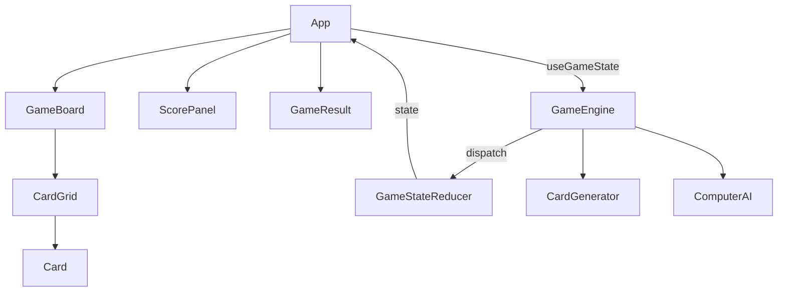

# Design Document

## Overview

React + TypeScript製のブラウザ動作型神経衰弱ゲーム。フロントエンドのみで完結し、バックエンド・DBは持たない。
コンポーネントはゲームロジック（カスタムフック）とUI（Reactコンポーネント）に分離し、状態管理はuseReducerで一元管理する。
コンピューターAIはゲームエンジン内に実装し、記憶ベースの戦略でプレイヤーに対抗する。

---

## Architecture

### High-Level Architecture



### System Components

| コンポーネント | 種別 | 説明 |
|---|---|---|
| `App` | React Component | ルートコンポーネント。ゲーム全体のレイアウトと状態配布 |
| `GameBoard` | React Component | カードグリッドと操作エリアのコンテナ |
| `ScorePanel` | React Component | ターン表示・スコア表示 |
| `CardGrid` | React Component | 16枚のカードを4×4グリッドで配置 |
| `Card` | React Component | 1枚のカード（表裏・フリップアニメーション） |
| `GameResult` | React Component | ゲーム終了時の勝敗表示・リプレイボタン |
| `useGameState` | Custom Hook | ゲームロジック全体を管理するカスタムフック |
| `GameEngine` | Module | ターン制御・ペア判定・ゲーム終了判定 |
| `CardGenerator` | Module | 絵文字の選択・カード生成・シャッフル |
| `ComputerAI` | Module | コンピューターの手選択ロジック（記憶ベース） |
| `GameStateReducer` | Reducer | ゲーム状態の純粋関数による更新 |

---

## Components and Interfaces

### Core Interfaces

```typescript
type CardId = string; // e.g. "card-0", "card-1"

type CardStatus = 'hidden' | 'flipped' | 'matched';

interface Card {
  id: CardId;
  emoji: string;
  pairId: string;   // 同じ絵文字のペアを識別するID
  status: CardStatus;
}

type Player = 'human' | 'computer';

type GamePhase =
  | 'idle'         // ゲーム開始前
  | 'playing'      // プレイ中
  | 'checking'     // ペア判定中（操作ロック）
  | 'finished';    // ゲーム終了

interface Score {
  human: number;
  computer: number;
}

interface GameState {
  cards: Card[];
  phase: GamePhase;
  currentTurn: Player;
  selectedCardIds: CardId[];   // 現在選択中のカード（最大2枚）
  score: Score;
  computerMemory: Record<CardId, string>; // AIが記憶しているカード位置（id -> emoji）
}

type GameAction =
  | { type: 'START_GAME' }
  | { type: 'FLIP_CARD'; cardId: CardId }
  | { type: 'RESOLVE_PAIR'; matched: boolean }
  | { type: 'COMPUTER_FLIP'; cardId: CardId }
  | { type: 'UPDATE_COMPUTER_MEMORY'; cardId: CardId; emoji: string }
  | { type: 'END_GAME' }
  | { type: 'RESET_GAME' };
```

---

### App

**Responsibilities:**
- ゲーム全体のレイアウト管理
- `useGameState` フックを呼び出し、state と dispatch を子コンポーネントへ配布

**Key Methods:**
- `render()` — phase に応じて GameBoard / GameResult を切り替え表示

---

### Card

**Responsibilities:**
- カード1枚のUI表示
- `status` に応じて裏面・表面・マッチ済みを表示
- CSSによるフリップアニメーション

**Key Methods:**
- `onClick(cardId)` — hidden 状態のカードクリック時に親へ通知

---

### useGameState (Custom Hook)

**Responsibilities:**
- `GameStateReducer` を `useReducer` で保持
- コンピューターAIのターン実行（`useEffect` + `setTimeout`）
- ペア判定後の状態更新タイミング制御

**Key Methods:**
- `handleCardClick(cardId: CardId): void` — プレイヤーのカード選択処理
- `handleRestart(): void` — ゲームリセット

---

### CardGenerator

**Responsibilities:**
- 使用する絵文字8種の選択
- 16枚のCardオブジェクト生成とシャッフル

**Key Methods:**
```typescript
function generateCards(): Card[]
function shuffleCards(cards: Card[]): Card[]
```

---

### ComputerAI

**Responsibilities:**
- 記憶済みカード情報からペアの選択肢を探す
- 記憶にない場合はランダムに未確定カードを選択

**Key Methods:**
```typescript
function selectCards(
  cards: Card[],
  memory: Record<CardId, string>
): [CardId, CardId]
```

---

### GameEngine

**Responsibilities:**
- ペア判定ロジック
- ゲーム終了条件チェック
- ターン切り替え判定

**Key Methods:**
```typescript
function isPair(card1: Card, card2: Card): boolean
function isGameOver(cards: Card[]): boolean
function getWinner(score: Score): Player | 'draw'
```

---

## Data Models

### File Storage Structure

バックエンド・DBは持たないため、永続化ストレージは不要。  
ゲーム状態はすべてReactのメモリ上（useReducer）で管理する。

### Project Directory Structure

```
concentration/
├── requirements.md
├── design.md
├── task.md
├── kiro-kit/                  # テンプレートキット（変更不要）
└── app/                       # Reactアプリ本体
    ├── package.json
    ├── tsconfig.json
    ├── vite.config.ts
    ├── index.html
    └── src/
        ├── main.tsx
        ├── App.tsx
        ├── App.css
        ├── types/
        │   └── game.ts        # Core Interfaces 定義
        ├── components/
        │   ├── Card/
        │   │   ├── Card.tsx
        │   │   └── Card.css
        │   ├── CardGrid/
        │   │   ├── CardGrid.tsx
        │   │   └── CardGrid.css
        │   ├── ScorePanel/
        │   │   └── ScorePanel.tsx
        │   ├── GameBoard/
        │   │   └── GameBoard.tsx
        │   └── GameResult/
        │       └── GameResult.tsx
        ├── hooks/
        │   └── useGameState.ts
        └── game/
            ├── cardGenerator.ts
            ├── computerAI.ts
            ├── gameEngine.ts
            └── reducer.ts
```

---

## Error Handling

| シナリオ | 対処方針 |
|---|---|
| 不正なカード選択（確定済み・選択中） | `phase === 'checking'` または `status !== 'hidden'` の場合はdispatchしない |
| コンピューターターン中のプレイヤー操作 | `currentTurn === 'computer'` の場合はクリックハンドラーをno-opにする |
| `generateCards` で絵文字が不足する場合 | 絵文字リストをハードコードで十分な数（20種以上）用意し、実行時エラーを防ぐ |

---

## Testing Strategy

### 単体テスト (Vitest)

| 対象モジュール | テスト内容 |
|---|---|
| `cardGenerator.ts` | 16枚生成・ペア数が正確・シャッフル後も全ペアが存在する |
| `gameEngine.ts` | ペア判定の正誤・ゲーム終了条件・勝者判定 |
| `computerAI.ts` | 記憶にペアがある場合に正しく選択する・記憶なしの場合にhiddenカードを選択する |
| `reducer.ts` | 各ActionTypeに対して期待されるstateになること |

### 結合テスト (React Testing Library)

| 対象 | テスト内容 |
|---|---|
| `useGameState` + `GameBoard` | カードクリック → 状態更新 → UI反映のフロー |
| ゲーム終了フロー | 全ペア確定 → `GameResult` 表示 → リプレイで初期化 |
